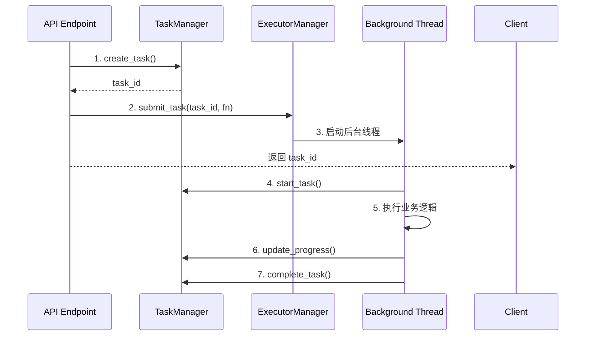

# TaskManager 与 ExecutorManager 使用指南

> **Project Yamato Shanghai** - 后台任务管理系统
> 
> 版本: 2.0 | 更新日期: 2025-12-24

## 📋 目录

- [概述](#概述)
- [架构设计](#架构设计)
- [快速开始](#快速开始)
- [TaskManager 使用](#taskmanager-使用)
- [ExecutorManager 使用](#executormanager-使用)
- [协作模式](#协作模式)
- [最佳实践](#最佳实践)
- [常见问题](#常见问题)

---

## 概述

Project Yamato 使用双管理器架构实现强大的后台任务处理能力：

| 管理器 | 职责 | 存储方式 |
|--------|------|---------|
| **TaskManager** | 任务状态管理与持久化 | Redis / 内存 |
| **ExecutorManager** | 任务执行与线程池管理 | 内存 (Future) |

### 核心特性

✅ **职责分离** - 状态管理与任务执行解耦  
✅ **灵活协作** - 可独立使用或协同工作  
✅ **线程安全** - 完善的并发控制机制  
✅ **协作式取消** - 优雅的任务中断机制  
✅ **自动集成** - 启动时自动建立连接  

---

## 架构设计

```
┌─────────────────────────────────────────────────────────────┐
│                      Application Layer                       │
│  (API Endpoints: /pdf/convert, /doc/process, etc.)          │
└────────────────────┬────────────────────────────────────────┘
                     │
         ┌───────────┴──────────┐
         ↓                      ↓
┌────────────────┐     ┌────────────────┐
│  TaskManager   │←───→│ExecutorManager │
│   (状态管理)    │     │   (任务执行)    │
└────────────────┘     └────────────────┘
         │                      │
         ↓                      ↓
  ┌─────────────┐      ┌─────────────┐
  │Redis/Memory │      │ ThreadPool  │
  │  (持久化)    │      │  (线程池)    │
  └─────────────┘      └─────────────┘
```

### 工作流程



---

## 快速开始

### 场景 1: 简单后台任务（只用 ExecutorManager）

**适用场景**: 不需要持久化状态的简单任务（如图片上传）

```python
from app.core.executor import executor_manager, CancellationToken

# 定义任务函数
def simple_task(token: CancellationToken, file_path: str):
    """第一个参数必须是 CancellationToken"""
    for i in range(100):
        if token.is_cancelled():
            return {"status": "cancelled"}
        # 处理文件...
    return {"status": "success", "result": "..."}

# 提交任务
task_id = executor_manager.generate_task_id("simple_task")
future = executor_manager.submit_task(task_id, simple_task, file_path="/path/to/file")

# 查询状态
if future.done():
    result = future.result()
```

### 场景 2: 复杂任务（协作模式）

**适用场景**: 需要跨请求查询状态、显示进度的复杂任务（如文档处理）

```python
from app.api.taskmanager import task_manager, TaskManager
from app.core.executor import executor_manager, CancellationToken

# 定义任务函数（在后台线程中执行）
def complex_task(token: CancellationToken, task_id: str, files: list):
    """复杂任务需要独立的 TaskManager 实例"""
    # 🔧 创建线程安全的 TaskManager 实例
    thread_tm = TaskManager.create_thread_safe_instance()
    
    import asyncio
    loop = asyncio.new_event_loop()
    asyncio.set_event_loop(loop)
    
    try:
        # 启动任务
        loop.run_until_complete(thread_tm.start_task(task_id))
        
        # 处理文件
        for i, file in enumerate(files):
            if token.is_cancelled():
                loop.run_until_complete(thread_tm.fail_task(task_id, "取消", "已取消"))
                return {"status": "cancelled"}
            
            # 更新进度
            progress = int((i + 1) / len(files) * 100)
            loop.run_until_complete(thread_tm.update_task_progress(task_id, progress, f"处理 {i+1}/{len(files)}"))
            
            # 处理文件...
        
        # 完成任务
        result = {"processed": len(files)}
        loop.run_until_complete(thread_tm.complete_task(task_id, result))
        return result
    finally:
        loop.close()

# 在 API 中使用
@router.post("/process")
async def process_files(files: list):
    # 1. 创建任务状态
    task_id = await task_manager.create_task(
        task_type="file_process",
        metadata={"file_count": len(files)}
    )
    
    # 2. 提交到线程池执行
    executor_manager.submit_task(task_id, complex_task, task_id, files)
    
    return {"task_id": task_id}

# 查询进度
@router.get("/task/{task_id}")
async def get_task_status(task_id: str):
    status = await task_manager.get_task_status(task_id)
    return status
```

---

## TaskManager 使用

### 初始化（自动完成）

应用启动时自动初始化，支持 Redis 和内存存储：

```python
# main.py - 自动集成
from app.core.executor import executor_manager
from app.api.taskmanager import task_manager

executor_manager.set_task_manager(task_manager, auto_sync=False)
```

### 核心 API

#### 1. 创建任务

```python
task_id = await task_manager.create_task(
    task_type="doc_process",  # 任务类型标识
    metadata={                # 任务元数据（可选）
        "file_ids": [1, 2, 3],
        "instance_id": 1
    }
)
```

#### 2. 启动任务

```python
await task_manager.start_task(task_id)
```

#### 3. 更新进度

```python
await task_manager.update_task_progress(
    task_id, 
    progress=50,           # 0-100
    message="正在处理第 5/10 个文件"
)
```

#### 4. 完成任务

```python
await task_manager.complete_task(
    task_id,
    result={               # 任务结果
        "success_count": 10,
        "failed_count": 0
    },
    message="处理完成"
)
```

#### 5. 失败任务

```python
await task_manager.fail_task(
    task_id,
    error="文件不存在",
    message="任务失败"
)
```

#### 6. 查询任务

```python
# 单个任务
task_status = await task_manager.get_task_status(task_id)

# 任务列表
tasks = await task_manager.list_tasks(
    task_type="doc_process",  # 可选：按类型过滤
    limit=10
)
```

#### 7. 删除任务

```python
success = await task_manager.delete_task(task_id)
```

### 线程安全方法（后台线程专用）

⚠️ **重要**: 在后台线程中必须创建独立实例避免事件循环冲突

```python
# 在后台线程函数中
def background_task(token, task_id):
    # ✅ 创建线程专用实例
    thread_tm = TaskManager.create_thread_safe_instance()
    
    loop = asyncio.new_event_loop()
    asyncio.set_event_loop(loop)
    
    try:
        loop.run_until_complete(thread_tm.start_task(task_id))
        # ... 业务逻辑 ...
        loop.run_until_complete(thread_tm.complete_task(task_id, result))
    finally:
        if hasattr(thread_tm.storage, 'redis_client'):
            loop.run_until_complete(thread_tm.storage.redis_client.aclose())
        loop.close()
```

### TaskStatus 数据结构

```python
@dataclass
class TaskStatus:
    task_id: str                                # 任务ID
    task_type: str                              # 任务类型
    status: Literal["pending", "running", 
                    "completed", "failed"]      # 任务状态
    created_at: str                             # 创建时间
    started_at: Optional[str] = None            # 启动时间
    completed_at: Optional[str] = None          # 完成时间
    progress: int = 0                           # 进度 (0-100)
    message: str = ""                           # 状态消息
    result: Optional[Dict[str, Any]] = None     # 任务结果
    error: Optional[str] = None                 # 错误信息
    metadata: Dict[str, Any] = None             # 元数据
```

---

## ExecutorManager 使用

### 初始化（自动完成）

全局单例，应用启动时自动初始化：

```python
from app.core.executor import executor_manager

# 默认配置
# - 线程池大小: 4 workers
# - 线程名前缀: bg_executor_
```

### 核心 API

#### 1. 提交任务

```python
from app.core.executor import CancellationToken

def my_task(token: CancellationToken, arg1, arg2):
    """
    ⚠️ 第一个参数必须是 CancellationToken
    """
    for i in range(100):
        # 检查取消标志
        if token.is_cancelled():
            return {"status": "cancelled"}
        # 业务逻辑...
    return {"status": "success"}

# 提交任务
task_id = executor_manager.generate_task_id("my_task")
future = executor_manager.submit_task(
    task_id,
    my_task,
    arg1="value1",
    arg2="value2"
)
```

#### 2. 生成任务 ID

```python
# 统一格式: {type}_{timestamp}_{uuid}
task_id = executor_manager.generate_task_id("pdf_convert")
# 例如: pdf_convert_20251224_155216_487_5a26b9a3
```

#### 3. 查询任务状态

```python
# 获取 Future 对象
future = executor_manager.get_task_future(task_id)

if future:
    if future.done():
        try:
            result = future.result()  # 获取结果
        except Exception as e:
            print(f"任务失败: {e}")
    else:
        print("任务正在运行")
```

#### 4. 取消任务

```python
success = executor_manager.cancel_task(task_id)

# 返回值:
# - True: 成功设置取消标志
# - False: 任务不存在或已完成

# ⚠️ 注意：
# - 如果任务未开始，会被取消（不执行）
# - 如果任务正在运行，需要任务主动检查 token.is_cancelled()
```

#### 5. 等待任务完成

```python
try:
    result = executor_manager.wait_task(task_id, timeout=30)
    print(f"任务完成: {result}")
except TimeoutError:
    print("等待超时")
except Exception as e:
    print(f"任务失败: {e}")
```

#### 6. 获取统计信息

```python
# 所有任务数量（包括已完成）
total = executor_manager.get_active_task_count()

# 正在运行的任务数量
running = executor_manager.get_running_task_count()
```

#### 7. 关闭线程池

```python
# 应用关闭时（main.py 中已配置）
executor_manager.shutdown(
    wait=True,           # 等待正在运行的任务完成
    cancel_futures=True, # 取消等待中的任务
    timeout=30.0         # 等待超时时间
)
```

### CancellationToken 使用

```python
def cancellable_task(token: CancellationToken):
    """协作式取消示例"""
    
    # 方式 1: 在循环中检查
    for i in range(1000):
        if token.is_cancelled():
            print("任务被取消")
            return {"status": "cancelled"}
        # 处理...
    
    # 方式 2: 在关键点检查
    result = expensive_operation()
    if token.is_cancelled():
        return {"status": "cancelled"}
    
    more_processing(result)
    return {"status": "success"}
```

---

## 协作模式

### 模式 1: 手动协作（推荐）

适用于需要精确控制的场景：

```python
from app.api.taskmanager import task_manager, TaskManager
from app.core.executor import executor_manager, CancellationToken

def process_task(token: CancellationToken, task_id: str, data: list):
    # 创建线程专用的 TaskManager
    thread_tm = TaskManager.create_thread_safe_instance()
    
    loop = asyncio.new_event_loop()
    asyncio.set_event_loop(loop)
    
    try:
        # 手动同步状态
        loop.run_until_complete(thread_tm.start_task(task_id))
        
        for i, item in enumerate(data):
            if token.is_cancelled():
                loop.run_until_complete(thread_tm.fail_task(task_id, "取消", "已取消"))
                return
            
            # 更新进度
            progress = int((i + 1) / len(data) * 100)
            loop.run_until_complete(
                thread_tm.update_task_progress(task_id, progress, f"处理 {i+1}/{len(data)}")
            )
            
            process(item)
        
        # 完成
        loop.run_until_complete(thread_tm.complete_task(task_id, {"count": len(data)}))
    finally:
        if hasattr(thread_tm.storage, 'redis_client'):
            loop.run_until_complete(thread_tm.storage.redis_client.aclose())
        loop.close()

# API 中使用
@router.post("/process")
async def process_endpoint(data: list):
    # 1. 创建任务状态
    task_id = await task_manager.create_task("process", {"count": len(data)})
    
    # 2. 提交执行
    executor_manager.submit_task(task_id, process_task, task_id, data)
    
    return {"task_id": task_id}
```

### 模式 2: 自动协作（实验性）

ExecutorManager 可以自动同步状态到 TaskManager：

```python
def auto_sync_task(token: CancellationToken, data: list):
    """任务函数只需关注业务逻辑"""
    result = []
    for item in data:
        if token.is_cancelled():
            return {"status": "cancelled"}
        result.append(process(item))
    return {"status": "success", "result": result}

# API 中使用
@router.post("/process")
async def process_endpoint(data: list):
    task_id = await task_manager.create_task("process")
    
    # 启用自动同步
    executor_manager.submit_task(
        task_id,
        auto_sync_task,
        data,
        sync_to_task_manager=True  # ✨ 自动同步状态
    )
    
    return {"task_id": task_id}
```

⚠️ **注意**: 自动协作模式目前仍在完善中，推荐使用手动协作模式。

---

## 最佳实践

### ✅ DO - 推荐做法

#### 1. 使用统一的任务 ID 生成

```python
# ✅ 推荐
task_id = executor_manager.generate_task_id("pdf_convert")

# ❌ 不推荐
task_id = f"pdf_convert_{uuid.uuid4().hex}"
```

#### 2. 在后台任务中创建独立的 TaskManager

```python
# ✅ 推荐 - 避免事件循环冲突
def background_task(token, task_id):
    thread_tm = TaskManager.create_thread_safe_instance()
    loop = asyncio.new_event_loop()
    asyncio.set_event_loop(loop)
    # ...

# ❌ 不推荐 - 会导致事件循环冲突
def background_task(token, task_id):
    task_manager.sync_start_task(task_id)  # 错误！
```

#### 3. 始终检查取消标志

```python
# ✅ 推荐 - 在关键点检查
def my_task(token: CancellationToken):
    for i in range(1000):
        if token.is_cancelled():
            return {"status": "cancelled"}
        # 处理...

# ❌ 不推荐 - 不检查取消标志
def my_task(token: CancellationToken):
    for i in range(1000):
        # 处理... (无法取消)
```

#### 4. 正确处理异常

```python
# ✅ 推荐
def my_task(token: CancellationToken, task_id: str):
    thread_tm = TaskManager.create_thread_safe_instance()
    loop = asyncio.new_event_loop()
    
    try:
        loop.run_until_complete(thread_tm.start_task(task_id))
        # 业务逻辑...
        loop.run_until_complete(thread_tm.complete_task(task_id, result))
    except Exception as e:
        loop.run_until_complete(thread_tm.fail_task(task_id, str(e)))
    finally:
        if hasattr(thread_tm.storage, 'redis_client'):
            loop.run_until_complete(thread_tm.storage.redis_client.aclose())
        loop.close()
```

#### 5. 清理资源

```python
# ✅ 推荐 - 在 finally 中清理
try:
    # 任务逻辑...
finally:
    if hasattr(thread_tm.storage, 'redis_client'):
        loop.run_until_complete(thread_tm.storage.redis_client.aclose())
    loop.close()
```

### ❌ DON'T - 避免的做法

#### 1. 在主线程中创建 TaskManager

```python
# ❌ 错误 - 会导致重复初始化
thread_tm = TaskManager()  # 不要直接实例化

# ✅ 正确
thread_tm = TaskManager.create_thread_safe_instance()
```

#### 2. 跨线程共享 Future

```python
# ❌ 错误 - Future 不是线程安全的
future = executor_manager.submit_task(...)
threading.Thread(target=lambda: future.result()).start()

# ✅ 正确 - 通过 task_id 查询
task_id = executor_manager.generate_task_id("...")
executor_manager.submit_task(task_id, ...)
# 在其他地方通过 task_id 查询
future = executor_manager.get_task_future(task_id)
```

#### 3. 阻塞主线程

```python
# ❌ 错误 - 阻塞 API 响应
@router.post("/process")
async def process(data: list):
    task_id = executor_manager.generate_task_id("...")
    future = executor_manager.submit_task(task_id, my_task, data)
    result = future.result()  # 阻塞！
    return result

# ✅ 正确 - 立即返回 task_id
@router.post("/process")
async def process(data: list):
    task_id = await task_manager.create_task("...")
    executor_manager.submit_task(task_id, my_task, data)
    return {"task_id": task_id}
```

---

## 常见问题

### Q1: 什么时候用 TaskManager，什么时候用 ExecutorManager？

**答案**:
- **只用 ExecutorManager**: 简单任务，不需要跨请求查询状态（如图片上传）
- **两者协作**: 复杂任务，需要显示进度、跨请求查询（如文档处理）

### Q2: 为什么后台线程中需要创建独立的 TaskManager？

**答案**: 
因为 TaskManager 的 Redis 连接绑定到主事件循环。后台线程有独立的事件循环，必须创建独立实例避免 "attached to a different loop" 错误。

### Q3: 如何实现任务取消？

**答案**:
1. 调用 `executor_manager.cancel_task(task_id)` 设置取消标志
2. 任务函数中主动检查 `token.is_cancelled()`
3. 返回或抛出异常退出任务

```python
def my_task(token: CancellationToken):
    for i in range(1000):
        if token.is_cancelled():
            return {"status": "cancelled"}
        # 处理...
```

### Q4: TaskManager 的 Redis 连接失败怎么办？

**答案**:
自动降级到内存存储，不影响功能。只是重启后任务状态会丢失。

### Q5: 如何限制并发任务数量？

**答案**:
配置线程池大小：

```python
# app/core/config.py
class Settings(BaseSettings):
    EXECUTOR_MAX_WORKERS: int = 4  # 调整这个值
```

### Q6: 任务超时怎么处理？

**答案**:
使用 `wait_task` 的 timeout 参数：

```python
try:
    result = executor_manager.wait_task(task_id, timeout=300)  # 5分钟
except TimeoutError:
    # 可以选择取消任务
    executor_manager.cancel_task(task_id)
```

### Q7: 如何查看所有正在运行的任务？

**答案**:

```python
# 统计信息
total_tasks = executor_manager.get_active_task_count()
running_tasks = executor_manager.get_running_task_count()

# 任务列表（通过 TaskManager）
tasks = await task_manager.list_tasks(limit=100)
running = [t for t in tasks if t.status == "running"]
```

### Q8: 任务函数可以是异步的吗？

**答案**:
不可以。任务函数在独立线程中运行，不能使用 `async def`。如需调用异步函数，使用事件循环：

```python
def my_task(token: CancellationToken):
    loop = asyncio.new_event_loop()
    asyncio.set_event_loop(loop)
    
    try:
        result = loop.run_until_complete(async_function())
    finally:
        loop.close()
    
    return result
```

---

## 示例代码

完整示例请参考：
- `app/api/v1/endpoints/pdf2image.py` - 简单任务示例
- `app/api/v1/endpoints/image2url.py` - 简单任务示例  
- `app/api/v1/document_processing.py` - 复杂任务协作示例

---

## 更新日志

### v2.0 (2025-12-24)
- ✨ ExecutorManager 支持可选的 TaskManager 集成
- ✨ TaskManager 新增 `create_thread_safe_instance()` 方法
- ✨ 统一的任务 ID 生成机制
- 🐛 修复事件循环冲突问题
- 📝 完善文档和示例

### v1.0 (Initial)
- 基础 TaskManager 功能
- 基础 ExecutorManager 功能
- Redis/内存双存储支持
- 协作式任务取消

---

## 技术支持

遇到问题？

1. 查看日志: `logs/app.log`
2. 查看代码注释
3. 参考示例代码
4. 联系开发团队

**Happy Coding! 🚀**

