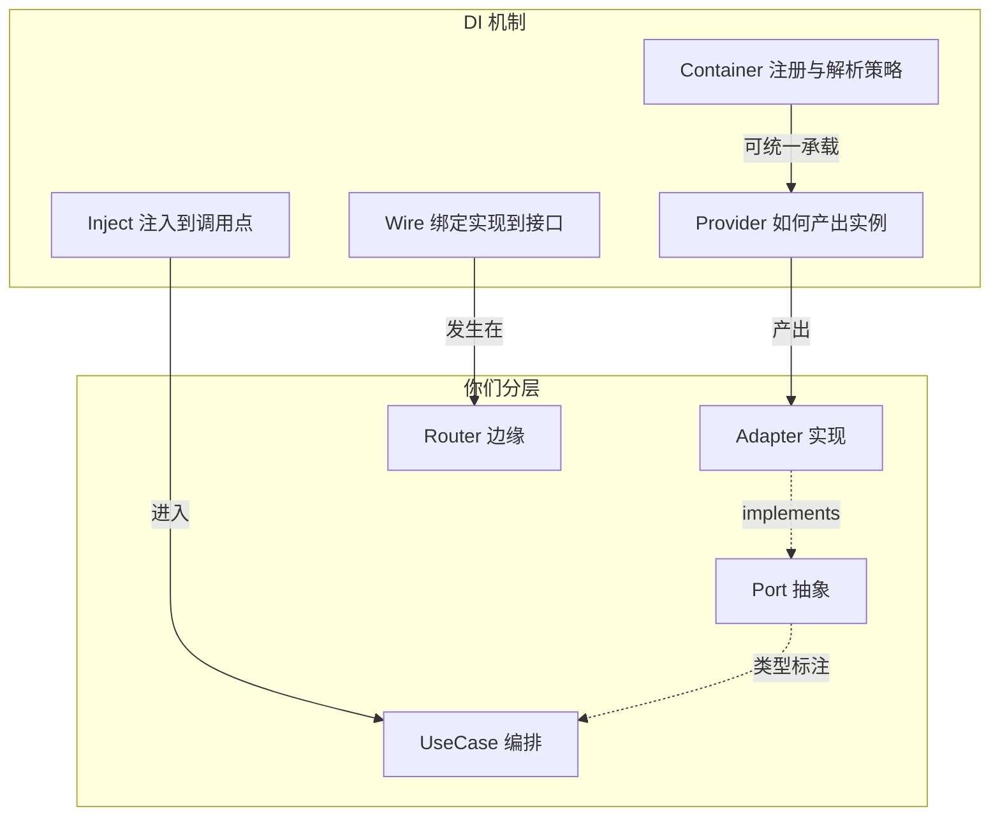

# DI 四概念与 Port / UseCase / Adapter / Router 的对应

本文说明 [Container / Provider / Inject / Wire] 等依赖注入概念如何落在本仓库的 **Port、UseCase、Adapter、Router** 之上，与 [Route → UseCase → Port → Adapter 调度方式](architecture-route-usecase-port-adapter.md) 及 [二期请求流说明](layered-architecture-phase2-request-flows.md) 一起阅读。

---

## 1. 核心结论：不是一一“同名对应”

Port、UseCase、Adapter、Router 是**六边形/分层**里的**角色**；  
Container、Provider、Inject、Wire 是**依赖注入**里的**机制**。

- **Port**：描述“需要哪种能力”的**抽象契约**（`Protocol` / ABC），不负责创建对象。
- **UseCase**：**消费**这些契约的业务编排，构造函数参数通常是 **Port 类型**（谁注入、由外层决定）。
- **Adapter**：**实现** Port 的**具体类**，是“可替换的实现”，一般由工厂或路由里 `new` 出来。
- **Router**：在 FastAPI 里常扮演 **Composition root（组合根）**：在这里把 Adapter 和 UseCase **装配**起来，并用 `Depends` 做请求级依赖。

因此：**Port / UseCase / Adapter / Router 不能分别“等于” Container / Provider / Inject / Wire**；更准确的是**交叉关系**（见下表与图）。

---

## 2. 四类 DI 概念在本项目里“落在哪里”

| DI 概念 | 含义 | 与分层的对应（谁扮演什么） | 项目中的现成例子 |
|--------|------|---------------------------|-----------------|
| **Container（容器）** | 管理**注册/解析**策略（单例、请求级、按接口取实现等） | **不单独属于** Port/UseCase/Adapter/Router 某一层，而是**横切基础设施**；若只做简单 FastAPI，常**隐式**存在（`app.state` + 模块级单例 + 各 router 里手写组装） | [`main.py`](../main.py) 里 `app.state.rag` 等；[`app/core/dependencies.py`](../app/core/dependencies.py) 提供解析入口（偏“基础设施依赖”） |
| **Provider（提供者）** | 声明**如何创建**或**如何取得**某依赖（Factory / 单例工厂） | 产出**具体实现**时，**Adapter 是“被创建的对象类型”**；`get_db()`、`get_rag_instance()` 这类是**基础设施型 Provider** | `get_db` / `get_rag_instance`；以及路由里 `SqlAlchemyXxxAdapter(db)`、`_submit_usecase(db)` 等**内联工厂** |
| **Inject（注入）** | 把已解析的依赖**塞进**函数/类 | **UseCase 构造函数** = 对领域侧而言的“**构造注入**”；**Router 的 `Depends(...)`** = 对 HTTP 边界的“**参数注入**” | [`document_processing.py`](../app/api/v1/document_processing.py) 中 `db: Session = Depends(get_db)`；`SubmitDocumentProcessingUseCase(..., registration=..., task_state=...)` |
| **Wire（连线/绑定）** | 把“**接口**”与“**实现**”在**组合根**里绑在一起 | 在二期文档中已写明：**Route 构造 Adapter 并注入 Port**（见 [layered-architecture-phase2-request-flows.md](layered-architecture-phase2-request-flows.md) 总览图） | [`document_processing.py`](../app/api/v1/document_processing.py) 的 `_submit_usecase`；[`chat_summary.py`](../app/api/v1/chat_summary.py) 中 `CreateChatSummaryUseCase(user_lookup=SqlAlchemyUserLookupAdapter(db), ...)` |

---

## 3. 与 Port / UseCase / Adapter / Router 的“角色表”（便于定名字）

- **Port**：只回答 **“依赖长什么样”**（接口名、方法签名）。**不是** Container，也**不是** Provider 的别名；若给模块起名，用 `ports`、`contracts` 即可（见 [`app/ports/`](../app/ports/)）。
- **UseCase**：只回答 **“业务步骤”**；通过构造函数接收 **Port**。**Inject 的目标之一**（领域侧）。
- **Adapter**：**Wire 的右侧**（具体类）；常由 **Provider/工厂** 创建。**不是** Wire 本身——**绑定动作**在 Router 或集中 DI 配置里。
- **Router**：**Wire 的主战场** + HTTP 级 **Inject**（`Depends`）。规范上可记：**“组合根默认在 `app/api/v1` 的 router 模块”**（与 `document_processing`、`chat_summary` 等模式一致）。

---

## 4. 规范命名时的建议用语

- **Container**：仅当引入**显式**集中注册（例如 `dependency-injector` 的 `Container` 或自写 `AppContainer`）时使用；与 **Port/Adapter 文件名**不必强行同名。
- **Provider**：在代码里可对应 **`get_*` / `provide_*` / `*_provider`**，专指 **可复用的**依赖解析函数；路由里一次性 `XxxAdapter(db)` 可称为**内联工厂**或**局部 provider**，团队内统一一种即可。
- **Inject / Injection**：文档里可写 **“UseCase 通过构造函数注入 Port；Router 通过 `Depends` 注入 Session/User”**，避免和“把 Adapter import 进 UseCase”混淆（后者会破坏分层规则）。
- **Wire / Wiring**：文档里可等价表述为 **“组合/装配/绑定”**；实现位置标为 **router 或 `dependencies` 中的 `*_usecase` 工厂**。

这样可把四类传统 DI 术语与 **Port / UseCase / Adapter / Router** 对齐，而不会在“哪一层=容器”上产生误读。
