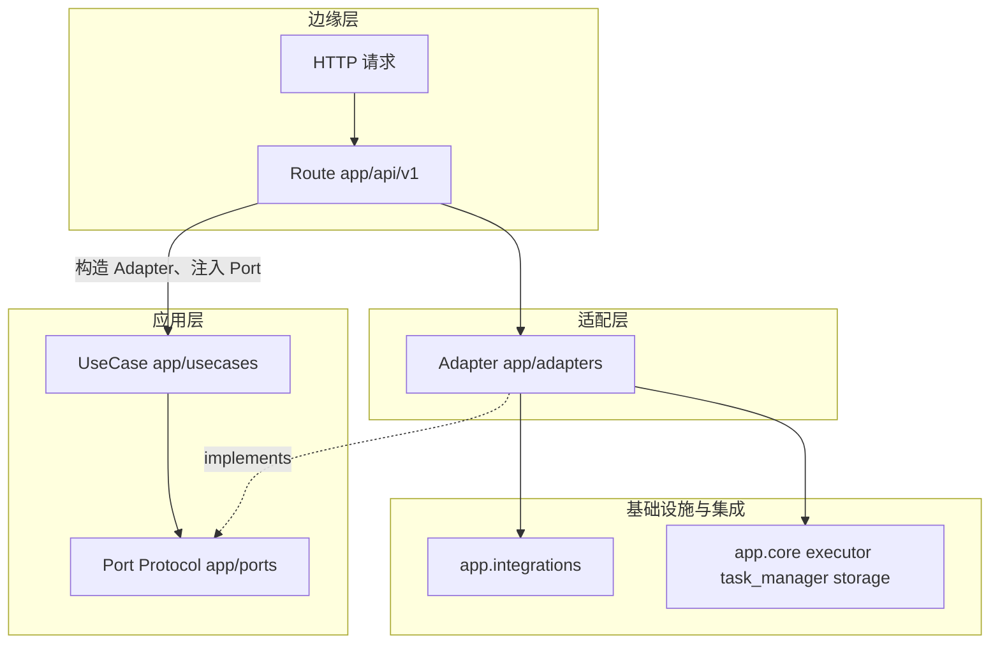
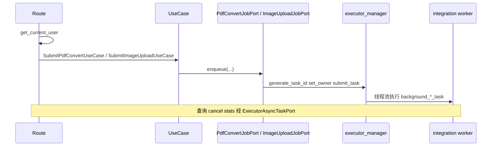
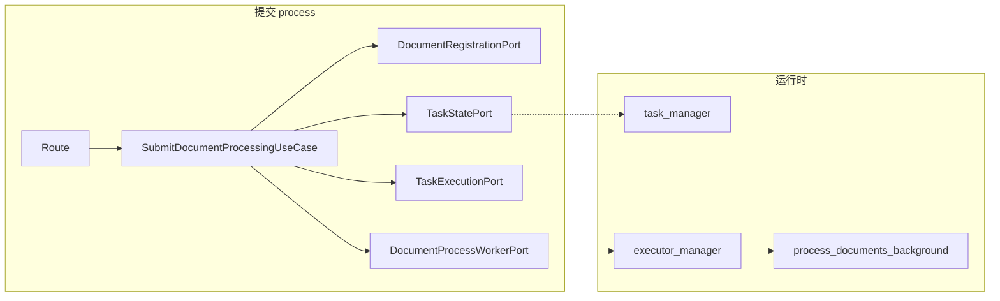
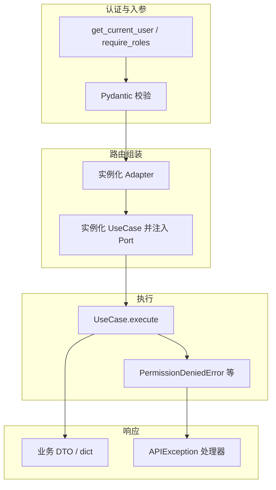

# 分层架构二期：请求流、认证与任务分发说明

> 本文描述二期整改后，各业务模块在 **Route → UseCase → Port（Protocol）→ Adapter → integrations / 基础设施** 链路上的数据流、认证发生位置与异步任务分发方式。  
> 架构原则见 [architecture-route-usecase-port-adapter.md](architecture-route-usecase-port-adapter.md)；DI 概念（Container / Provider / Inject / Wire）与分层角色对应见 [di-and-layered-architecture.md](di-and-layered-architecture.md)。整改清单见 [layered-architecture-remediation-phase2-plan.md](layered-architecture-remediation-phase2-plan.md)。  
> CI 守卫见 [scripts/check_layered_architecture.sh](../scripts/check_layered-architecture.sh)。

---

## 1. 总览：统一调用链

**依赖方向**：UseCase 只依赖 Port；Adapter 实现 Port 并调用 `integrations` / `core`；Route 不直接 `import app.integrations`（守卫脚本列出的路由文件）。

**错误与 HTTP**：UseCase 内优先抛出 `app.core.exceptions` 下的 `APIException` 子类（如 `PermissionDeniedError`、`NotFoundError`、`ValidationError`）；`main.py` 中全局 `APIException` 处理器映射为 JSON。路由层可对未预料异常记日志并返回 500。

---

## 2. 认证节点总表

| 环节 | 机制 | 典型位置 |
|------|------|----------|
| 登录态 | `Depends(get_current_user)` | 各需登录路由 |
| 角色门禁 | `Depends(require_roles(...))` | 如 closing_form 审批、collection2、批量删除文件 |
| 资源归属（线程池任务） | `owner_id` 与 `current_user.id` 比较；`superuser` 放行 | `app/usecases/async_executor/*`、`document_processing/lifecycle.py` |
| 上传者别名 | `normalize_self_uploader` | PDF 转换提交、文档处理提交等 |
| 业务用户标识 | `normalize_self_user_identifier`；admin/superuser 可代查他人 | `CompressContextUseCase` |
| 文件记录 | `uploader` 与 `current_user.username`；superuser 放行 | `file_manager` UseCase |

---

## 3. 异步任务：两类分发模型

### 3.1 模型 A：仅 ExecutorManager（PDF 转图、图片上传 MinIO）

**分发**：`PdfConvertJobAdapter` / `ImageUploadJobAdapter` 内调用 `executor_manager.generate_task_id`、`set_task_owner`、`submit_task(..., background_worker, ...)`。

**状态查询**：`GetExecutorTaskStatusUseCase` / `GetExecutorTaskResultUseCase` 通过 `ExecutorAsyncTaskPort` 读取 `Future` 与 `owner`，鉴权在 UseCase 内。

**涉及文件**：`app/api/v1/pdf2image.py`、`app/api/v1/image2url.py`；用例 `app/usecases/async_executor/`；适配 `app/adapters/ocr_executor_jobs.py`。

---

### 3.2 模型 B：TaskManager + ExecutorManager（文档批处理）

**提交**：`TaskStatePort.create_task` 写入任务元数据（含 `owner_id`）→ `TaskExecutionPort.set_task_owner` → `DocumentProcessWorkerPort.submit_process_documents`（内部 `submit_task(process_documents_background, ...)`）。

**取消**：`CancelDocumentTaskUseCase` 结合 `TaskStatePort.get_task_snapshot`、`ExecutorAsyncTaskPort.cancel_task` 与 `get_task_future`；必要时 `update_task_message` / `fail_task`。

**涉及文件**：`app/api/v1/document_processing.py`；用例 `app/usecases/document_processing/`；适配 `app/adapters/document_processing.py`、`app/adapters/tasking.py`、`app/adapters/ocr_executor_jobs.py`（仅取消时读 Future）。

---

### 3.3 模型 C：报价任务（一期已存在，供对照）

**分发**：`TaskDispatchPort` 调用 `dispatch_quotation_queue_for_owner` / `dispatch_quotation_phase2`；状态与 DB 经 `QuotationTaskRepoPort`、`TaskStatePort`。

数据流见 [architecture-route-usecase-port-adapter.md](architecture-route-usecase-port-adapter.md) 第 7.3 节。

---

## 4. 按模块：数据流摘要

### 4.1 PDF 转图片（`pdf2image`）

| 步骤 | 数据流 |
|------|--------|
| 提交 | `UploadFile` 读字节 → `SubmitPdfConvertUseCase` → `PdfConvertJobPort.enqueue_pdf_convert` → `executor_manager` + `background_pdf_convert_task` |
| 状态/结果 | `task_id` + `User` → `GetExecutorTaskStatusUseCase` / `GetExecutorTaskResultUseCase` → `ExecutorAsyncTaskPort` 轮询 `Future` |
| 页数 | 字节 + 类型 → `PdfPageCountUseCase` → `PdfPageCountPort` → `integrations.ocr.pdf2image` |

**认证**：`get_current_user`；提交时 `normalize_self_uploader`；查询/取消时 owner 或 `superuser`（UseCase 内）。

---

### 4.2 图片上传 OCR 桶（`image2url`）

与 4.1 类似，提交走 `ImageUploadJobPort` → `background_image_upload_task`；统计接口走 `GetExecutorTaskStatsUseCase`，仅 `superuser`。

---

### 4.3 文档处理（`document_processing`）

| 步骤 | 数据流 |
|------|--------|
| 提交 | `List[UploadFile]` → `DocumentRegistrationPort.register_uploaded_files`（MinIO + DB）→ `TaskStatePort.create_task` → `TaskExecutionPort.set_task_owner` → `DocumentProcessWorkerPort.submit_process_documents` |
| 状态/列表 | `TaskStatePort.get_task_snapshot` / `list_task_snapshots`；列表按 `owner_id` 与角色过滤在 UseCase |
| 取消/删除 | 鉴权后 `ExecutorAsyncTaskPort.cancel_task` 或 `remove_task_record` |

**认证**：`get_current_user`；`normalize_self_uploader`；任务级 owner / `superuser`。

---

### 4.4 文件管理（`file_manager`）

| 步骤 | 数据流 |
|------|--------|
| 上传 | 流 + 参数 → `UploadFileUseCase` → `FileManagerPort.upload_stream_persist` → `integrations.file_manager.service` |
| 列表/搜索 | `ListFilesUseCase` / `SearchFilesUseCase` → Port（查询侧已按用户过滤或 super 全量） |
| 下载/详情/删除 | `GetFileForAccessUseCase` / `DeleteFileUseCase`：先取 `FileRecordDTO` 再校验 `uploader` |
| 批量删除 | `BatchDeleteFilesUseCase`：仅 `superuser`，Port `batch_delete_ids` |

**下载**：UseCase 返回有权限的 DTO；路由层仍用 `download_object_stream(minio_object_path)` 组装 `StreamingResponse`（流在边缘层，权限在 UseCase）。

---

### 4.5 上下文压缩（`context_compression`）

| 步骤 | 数据流 |
|------|--------|
| 压缩 | `ContextCompressionRequest` → `CompressContextUseCase` 解析有效 `user_id`（admin/superuser 或 `normalize_self_user_identifier`）→ `ContextCompressorPort.compress` → `compress_context` |

**认证**：`get_current_user`；业务 user 越权在 UseCase 内触发 `HTTPException`（安全模块）或后续 `APIException` 链。

**校验**：`conversation_id` 经 `app.core.validators.conversation_id`（路由 Pydantic validator）。

---

### 4.6 闭单表单（`closing_form`）

| 步骤 | 数据流 |
|------|--------|
| 各操作 | Route → 薄 UseCase → `ClosingFormServicePort` → `integrations.closing_form.service` |

**认证**：`get_current_user`；审批/管理接口 `require_roles(admin|superuser)` 在 Route 的 `Depends`。

---

### 4.7 SQL Server 查询（`sqlserver_queries`）

| 步骤 | 数据流 |
|------|--------|
| 查询 | `U8BomInventoryRequest` / `PdmBomRequest` → `RunU8BomInventoryQueryUseCase` / `RunPdmBomQueryUseCase` → Port → `run_u8_bom_inventory_query` / `run_pdm_bom_query` |

**认证**：`get_current_user`（需登录）；无资源级 owner，与整改前一致。

---

### 4.8 聊天摘要 / 报价（一期）

- **聊天摘要**：`UserLookupPort` 解析有效用户 + `ChatArchivePort` / `ChatSummaryRepoPort`。  
- **报价**：多 Port 编排 + `TaskDispatchPort` + `ThreadPoolTaskExecutionAdapter`。

二者路由同样不直连 `integrations`（守卫已覆盖）。

---

## 5. 全局流程图：从请求到集成

---

## 6. 维护说明

- 新增业务 API 时：优先增加 **Port 方法或新 Port** → **Adapter 实现** → **UseCase 编排** → Route 只做依赖组装。  
- 不要将 `from app.integrations` 写入 `app/usecases` 或守卫列表中的路由文件。  
- 权限与任务归属判断应放在 **UseCase**，避免仅在路由层分散判断，便于单测（Fake Port）。

---

## 7. 相关路径索引

| 类型 | 路径 |
|------|------|
| Port（分层） | `app/ports/dto/`（数据类）、`app/ports/contracts/`（通用 `Protocol`）、`app/ports/domains/`（业务线 `Protocol`，如 `document_processing.py`、`file_manager.py`、`ocr_async.py`、`context_compression.py`、`closing_form.py`、`sqlserver_queries.py` 等） |
| Adapter | `app/adapters/`（含 `tasking.py`、`ocr_executor_jobs.py`、`document_processing.py`、`file_manager.py`、`context_compression.py`、`closing_form.py`、`sqlserver_queries.py`） |
| UseCase | `app/usecases/async_executor/`、`document_processing/`、`file_manager/`、`context_compression/`、`closing_form/`、`sqlserver_queries/`、以及 `quotation/`、`chat_summary/` |
| 分层检查 | `scripts/check_layered_architecture.sh` |
