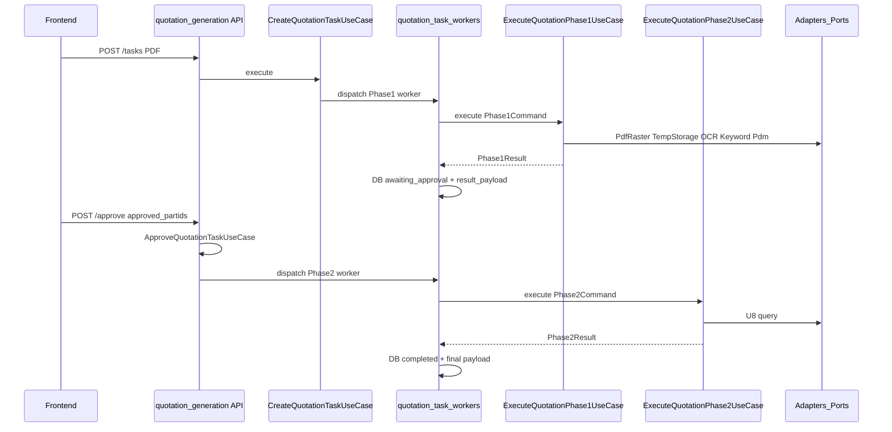

# 报价生成：任务与数据流

本文描述「报价生成」从上传到 Phase2 完成的**任务状态**、**调用链**与 **`result_payload` 字段**，并说明 **Use Case / Port / Adapter** 分工，便于新同事定位代码。

## 目录与分工

| 层级 | 职责 | 路径 |
|------|------|------|
| Use Case | 业务流程编排（顺序、用哪些 Port、领域纯函数） | `app/usecases/quotation/` |
| Port | 外向契约（Protocol + DTO） | `app/ports/domains/quotation.py`, `app/ports/domains/sqlserver_queries.py` |
| Adapter | 唯一调用 `app/integrations/...` 的边界 | `app/adapters/quotation/`, `app/adapters/sqlserver_queries.py` |
| Domain | 无 I/O 的纯函数与共享异常 | `app/domain/quotation/` |
| Integration | 第三方/HTTP/SQL 等实现细节 | `app/integrations/...`（仅 Adapter 引用） |

**Phase1 编排用 Port（一类外部能力一个 Port）：**

| Port | 职责 | Adapter |
|------|------|---------|
| `PdfFirstPageRasterPort` | PDF 第一页栅格化 | `PdfFirstPageRasterAdapter` |
| `QuotationTempObjectStoragePort` | 临时页图上传，返回可访问 URL | `QuotationTempObjectStorageAdapter` |
| `OcrStructuredInfoPort` | 布局 OCR + 结构化字段 | `OcrStructuredInfoAdapter` |
| `KeywordPayloadMappingPort` | `SpecificationMapping` → `keywords_payload` | `KeywordPayloadMappingAdapter` |
| `PdmBomQueryPort` | PDM BOM 查询（支持 `cancel_checker`） | `PdmBomQueryAdapter` |

**Phase2：** `ExecuteQuotationPhase2UseCase` 使用 `U8BomInventoryQueryPort`（`U8BomInventoryQueryAdapter`），以及 domain 模块 `partid_mapping`、`u8_grouping`。

**装配：** `app/adapters/quotation/deps.py` 提供 `build_execute_quotation_phase1_use_case()` / `build_execute_quotation_phase2_use_case()`，Worker 只依赖工厂，避免散落 `new` Adapter。

## 任务状态机

典型路径：

`queued` → `running`（Phase1）→ `awaiting_approval` → `running`（Phase2）→ `completed`

失败或取消：`failed` / `cancelled`（以 `app/models/orm/quotation_task.py` 中 `QuotationTaskStatus` 为准）。

## 控制流（序列图）

## 数据流：`result_payload` 与阶段产物

### Phase1 结束（`awaiting_approval`）

Worker 在 Phase1 成功后合并 `Phase1Result.to_dict()` 并追加预计算的 U8 父编码（供审核 UI 等使用），主要包括：

- `keywords_payload`：PDM 查询用关键字结构
- `pdm_result`：PDM BOM 原始响应（字典形式）
- `pdm_partids`：从 `pdm_result.items` 抽取的去重 `PARTID` 列表
- `temp_image_minio_path` / `temp_image_url`：临时页图
- `raw_extracted_info`：OCR 清洗后的结构化信息
- `u8_parent_inv_codes`：由 `pdm_partids` 经 domain `convert_partids_to_u8_codes` 得到的去重 U8 父编码列表
- `pdm_to_u8_code_mappings`：`{pdm_partid, u8_parent_inv_code}` 列表

审核请求体中的 `approved_partids` 由前端提交；`ApproveQuotationTaskUseCase` 将其校验后写入任务并触发 Phase2。

### Phase2 结束（`completed`）

Worker 用 Phase2 结果覆盖/精简为最终 `result_payload`，核心字段包括：

- `keywords_payload`：自 Phase1 保留
- `approved_partids`：用户勾选的 PARTID 列表（若未带则 Worker 侧可能回退到 `pdm_partids`，与实现一致）
- `u8_result`：U8 BOM + Inventory 扁平结果
- `u8_result_by_type` / `u8_result_type_summary`：按关键字 type 分组后的视图（当 `keywords_payload` 非空时由 domain `group_u8_result_by_type` 生成）

## 与 REST `sqlserver_queries` 的关系

- **同一套** `app/integrations/sqlserver` 中的 `run_pdm_bom_query` / `run_u8_bom_inventory_query`。
- HTTP 路由通过 `RunPdmBomQueryUseCase` / `RunU8BomInventoryQueryUseCase` 调用 Adapter，**不传** `cancel_checker`（默认 `None`）。
- 报价 Worker 通过 Execute Use Case 调用同一 Adapter，**传入** `cancel_checker` 以支持协作式取消。

## 协作式取消与异常

- 取消：`QuotationPipelineCancelledError`（`app/domain/quotation/exceptions.py`），在 OCR/PDM/U8 步骤间检查。
- 业务不可恢复错误：`QuotationPipelineError`（例如 PARTID 为空无法查 U8）。

## Worker 职责边界

`app/integrations/Quotation_Generation/quotation_task_workers.py` 仅负责：

- 线程内事件循环、TaskManager 进度同步
- 从 MinIO 下载上传的 PDF
- 调用 `build_execute_quotation_phase*_use_case()` 与对应 `ExecuteQuotationPhase*Command`
- 更新 ORM `QuotationTask` 与清理临时文件

不在 Worker 中实现 OCR/PDM/U8 业务细节。
